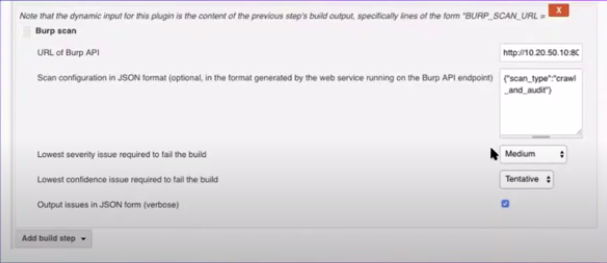
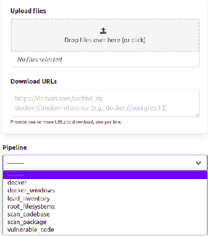

# 1. About Me

## 1.1. Basic information

* *Name:* Yunus AYDIN

* *Email:* [aydinnyunus@gmail.com](mailto:aydinnyunus@gmail.com)

* *GitHub:* [https://github.com/aydinnyunus](https://github.com/aydinnyunus)

* *Twitter:* [https://twitter.com/aydinnyunuss](https://twitter.com/aydinnyunuss)

* *Blog:* [https://medium.com/@sockpuppets](https://medium.com/@sockpuppets)

* *Timezone:* UTC+03:00 (ISTANBUL)

## 1.2. Background and programming experience

I am a third year student of the Istanbul Ticaret University (Turkey), pursuing a degree in Computer Engineering. I originally started programming in C/C++ in my first year of middle school, later moving on to Python, Golang, PHP and HTML/CSS/JavaScript. I mainly working on Python and Golang, generally focusing personal projects. I primarily use [IntelliJ Pycharm](https://www.jetbrains.com/python/) for Python development and IntelliJ Products for other developments. Also I'm doing Bug Bounty on my free time. You can check my Hall of Fames on my [Website.](http://sockpuppets.ninja/)

I am familiar with Python’s core features, Web frameworks (Django, Dash), API development. I’ve previously worked in StrixEye (which is a Cyber Security Start Up) , worked with YARA, MODSecurity, Golang for 1 year. You can check my personal projects on [Github Page](https://github.com/aydinnyunus)
For the Dash, I created Rocket Dashboard for getting simulteanous information about Rocket like velocity,altitude,pressure etc. and show on graph. (TeknoFest - which is Space and Technology Festival is an aviation, technology and space technology festival held in Turkey.)

# 2. Proposal Information

## 2.1. Project summary


**VulnerableCode: Vulnerability code scanners (e.g. static code analysis)**

Create scanners which would verify whether a codebase is vulnerable to a vulnerability. Once we know that a vulnerable package is in use, a scanner could check for whether the vulnerable code is called, or if environmental conditions or configuration are conducive to the vulnerability, etc. This could be based on yara rules, OpenVAS or similar. Or based on Eclipse Steady and deeper code analysis, static or dynamic.

## 2.2. Project description and timeline
## FIRST IDEA
### Phase 1: Extracting currently used Packages, Licences

First step is, extracting currently used packages, licences using ScanCode.io. For the getting these informations, we can create scancode.io and vulnerable code on different ports so they can communicate. In the CI/CD Pipeline, all project files should be scan by scancode.io using REST API.


1. **REST API Scancode.io** (extracted from [scancode.io REST API](https://scancodeio.readthedocs.io/en/latest/rest-api.html)) - implements a set of utilities for scanning code, creating project, upload file etc.
2. **REST API VulnerableCode** (extracted from [VulnerableCode REST API](https://github.com/nexB/vulnerablecode)) - implements a set of utilities for getting vulnerable packages information using purl

#### Steps to Reproduce
* Creating Project on scancode.io using cURL
```
api_url="http://localhost/api/projects/"
content_type="Content-Type: application/json"
data='{
    "name": "project_name",
    "input_urls": "https://download.url/package.archive",
    "pipeline": "scan_package",
    "execute_now": true
}'

curl -X POST "$api_url" -H "$content_type" -d "$data"
```


* Upload project files using cURL

```
api_url="http://localhost/api/projects/6461408c-726c-4b70-aa7a-c9cc9d1c9685/add_input/"
upload_file="/path/to/the/archive.zip"

curl -X POST "$api_url" -F "upload_file=@$upload_file"
```

* Add Pipeline for getting necessary information

```
api_url="http://localhost/api/projects/6461408c-726c-4b70-aa7a-c9cc9d1c9685/add_pipeline/"
content_type="Content-Type: application/json"
data='{
    "pipeline": "docker",
    "execute_now": true
}'

curl -X POST "$api_url" -H "$content_type" -d "$data"
```

* Get Information using GET Request

```
GET /api/projects/<PROJECT UUID>/packages/

[
    {
        "purl": "pkg:deb/debian/libdb5.3@5.3.28%2Bdfsg1-0.5?arch=amd64",
        "type": "deb",
        "namespace": "debian",
        "name": "libdb5.3",
        "version": "5.3.28+dfsg1-0.5",
        "[...]": "[...]"
    }
]
```

we can calculate risk score for each project or file and if risk score above the threshold, author can not push new changes to branch.

*Approximate implementation time: 2 days*

### Phase 2: Use VulnerableCode for Finding Vulnerabilities

Now we have project packages but we don't know these packages are vulnerable or not. Let's find out. We can use VulnerableCode API for getting quick and simple response. We can extract the purls from previous Phase sending GET Request to `/api/projects/<PROJECT UUID>/packages/`, so we can transfer these informations to VulnerableCode API after the formatting.

**Request Example**
```
POST /api/packages/bulk_search HTTP/1.1
Host: localhost
Connection: close
Content-Length: 113
Content-Type: application/json

{
  "purls": [
    "pkg:deb/debian/curl@7.50.3-1?arch=i386&distro=jessie",
    "pkg:pypi/django@3.2.1"
  ]
}
```

**Response Example**

```
{"type":"deb","namespace":"debian","name":"curl","version":"7.50.3-1","qualifiers":{"arch":"i386","distro":"jessie"},"subpath":null,"unresolved_vulnerabilities":[],"resolved_vulnerabilities":[],"purl":"pkg:deb/debian/curl@7.50.3-1?arch=i386&distro=jessie"}
```

*Approximate implementation time: 1 day*


### Phase 3: Formatting Scancode.io Output to VulnerableCode Input

We need to format Scancode.io Output to VulnerableCode Input because they are not suitable for each other.

**Scancode.io Output**
```
[
    {
        "purl": "pkg:deb/debian/libdb5.3@5.3.28%2Bdfsg1-0.5?arch=amd64",
        "type": "deb",
        "namespace": "debian",
        "name": "libdb5.3",
        "version": "5.3.28+dfsg1-0.5",
        "[...]": "[...]"
    }
]
```

**VulnerableCode POST data Example**
```
{
  "purls": [
    "pkg:deb/debian/curl@7.50.3-1?arch=i386&distro=jessie",
    "pkg:pypi/django@3.2.1"
  ]
}
```

**PseudoCode for scancode.io input to vulnerable code API**

```
import json
import requests

url = "http://vulnerable.code/api/packages/bulk_search/" # VulnerableCode API
j = ""

# scancode.io output JSON which we get on Phase 1:
x = '[{"purl": "pkg:deb/debian/libdb5.3@5.3.28%2Bdfsg1-0.5?arch=amd64","type": "deb","namespace": "debian","name": "libdb5.3","version": "5.3.28+dfsg1-0.5"},{"purl": "pkg:pypi/django@3.2.1","type": "deb","namespace": "debian","name": "libdb5.3","version": "5.3.28+dfsg1-0.5"}]'

# parse x:
y = json.loads(x)


for i in range(len(y)):
	purl = y[i]['purl']
	j = '"' + purl + '"'

	data = {
	  "purls": [
	    	purl
  				]
			}

	headers = {'Content-type': 'application/json'}
	r = requests.post(url, data=json.dumps(data), headers=headers)
	print(r.text)

```

**Response**
```
[
  {
    "type": "deb",
    "namespace": "debian",
    "name": "libdb5.3",
    "version": "5.3.28+dfsg1-0.5",
    "qualifiers": {
      "arch": "amd64"
    },
    "subpath": null,
    "unresolved_vulnerabilities": [],
    "resolved_vulnerabilities": [],
    "purl": "pkg:deb/debian/libdb5.3@5.3.28%2Bdfsg1-0.5?arch=amd64"
  }
]
[
  {
    "type": "pypi",
    "namespace": null,
    "name": "django",
    "version": "3.2.1",
    "qualifiers": null,
    "subpath": null,
    "unresolved_vulnerabilities": [],
    "resolved_vulnerabilities": [],
    "purl": "pkg:pypi/django@3.2.1"
  }
]
```

*Approximate implementation time: 1-2 days*

### Phase 4: Restricting Pushing

VulnerableCode Packages have Severity (class VulnerabilitySeverity). We can create function which returns CVSS score for each vulnerability and show their criticality on dashboard. ( Or basically we can check for number of high or critical vulnerabilities)

```
vulnerabilities/importers/nvd.py
@staticmethod
    def extract_severity_scores(cve_item):
        severity_scores = []

api.py
def bulk_search(self, request):
```

We can return severity scores array for each package URL and we check for CRITICAL and HIGH severity vulnerabilities for allow commit and push events. If it is MEDIUM and LOW severities, give warning for that vulnerabilities but author accepts that risk after it will be commited.

*Approximate implementation time: 1-2 days*



In this Example, Burp Suite Enterprise provides Severity and Confidence for checking security of the project. So I think we can integrate that feature in dashboard.

### Phase 5: Auto Update Dependencies
I don’t think I need to convince you about the benefits of keeping your Python libraries (or other software as a matter of fact) up to date: bugs are fixed over time, potential security vulnerabilities are patched, compatibility issues may arise, etc. And the list goes on and on.

`pur` stands for pip update requirements and is a small Python library that can update a requirements file with a single command.

`pur -r requirements.txt`

Which modifies the requirements.txt with the latest versions of the libraries listed in the file. When doing so, it prints the following:

```
Updated pandas: 1.2.4 -> 1.4.1
Updated yfinance: 0.1.63 -> 0.1.70
All requirements up-to-date
```

*Approximate implementation time: 1 day*

## SECOND IDEA
We should add new Pipeline as "Vulnerable Code" on Scancode.io and then if author selects that Pipeline. All uploaded project is scanned by Scancode.io and checks the vulnerabilities from Vulnerable Code.

### How to Add New Pipeline
- Firstly create Python file on "./scanpipe/pipelines/<YOUR PIPELINE FILE>.py"
- After that add this file on setup.cfg



```
scancodeio_pipelines =
    vulnerable_code = scanpipe.pipelines.vulnerable_code:VulnerableCode
```
- Run `docker-compose build && docker-compose up`, after that you can see your pipeline on `localhost:80/project/add`

### Create Python Pipeline File
- Add required steps

```
@classmethod
    def steps(cls):
        return (
            ..
            ..
            cls.run_scancode,
            cls.check_vulnerablecode,
            ..
            cls.make_summary_from_scan_results,
        )
```
- Create Required Functions

```
def check_vulnerablecode(self):
        """
        Check packages are vulnerable on Vulnerable Code
        """
        # Send API Request to Vulnerable Code using Package URL and get the required informations about package.
	# You can check **PseudoCode for scancode.io input to vulnerable code API** on Phase 3
	..
	..
```

*Approximate implementation time: 1-2 weeks*

## THIRD IDEA
We can use Yara or ModSecurity Rules for getting Package Name, Version, Licences etc. I think it will be faster than ScanCode.io.
	
```
SecRule REQUEST_BODY \
"@rx (\d+\.)?(\d+\.)?(\*|\d+)" \
"id:000000,\
phase:2,\
block,\
t:none,t:lowercase,\
msg:'Get Versions from Request Body',\
```
	
```
SecRule REQUEST_BODY \
"@rx .+?(?===)" \
"id:000001,\
phase:2,\
block,\
t:none,t:lowercase,\
msg:'Get Name from Request Body',\
```

After getting these informations we can convert it to Package URL and send Package URL to Vulnerable Code API. So In this way, we got the ScanCode.io out of the way and use ModSecurity or Yara Rules.
	
*Approximate implementation time: 2-3 days*

	
## 2.3 Additional notes

### Fix DockerFile Latency

If developers change setup files for adding new functions to the applications (Scancode.io & VulnerableCode), DockerFile did not use caching for `pip install .` But If we change lines 56-57, now Docker use caching for pip before the COPY. So did not install packages every config changes. 
```
RUN pip install .
COPY setup.cfg setup.py /app/
```

## Available Hours
I’m planning to dedicate 40 hours per week to the project (8 hours per day, Monday to Friday). Sundays will be spent restructuring the code created throughout the week and submitting it in a pull request for evaluation.

The project repository will utilise the [git-flow](http://nvie.com/posts/a-successful-git-branching-model/) methodology:

* Features will be developed in separate branches and merged into develop at the end of each project phase.

* The develop branch will be merged into master on the midterm and final evaluation releases, and corresponding GitHub releases (provisional SemVer versions: 0.5.0 and 1.0.0 respectively) will be created.
